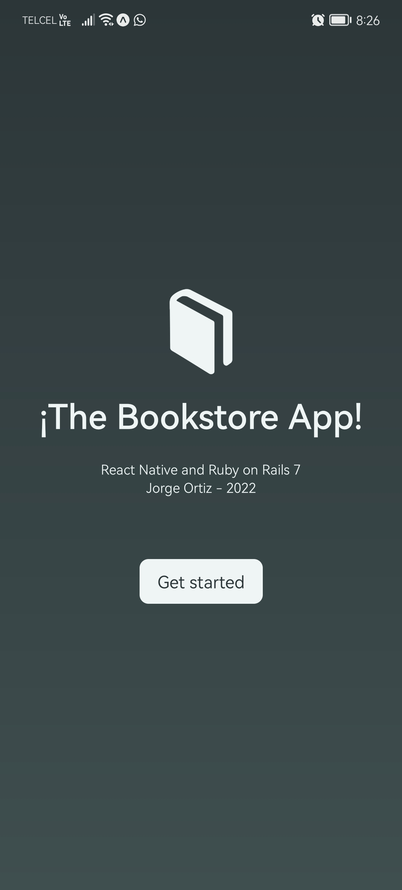
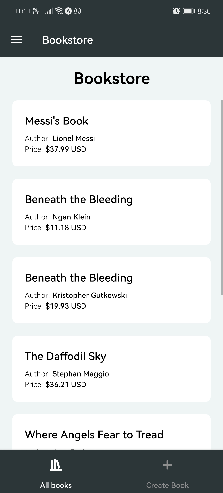
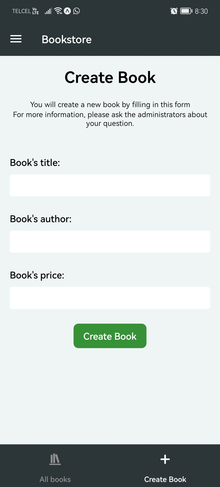
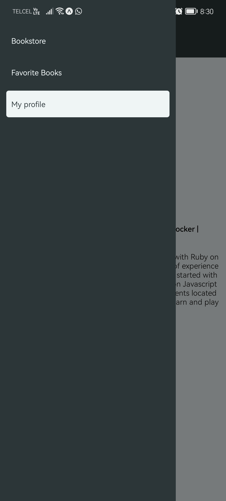
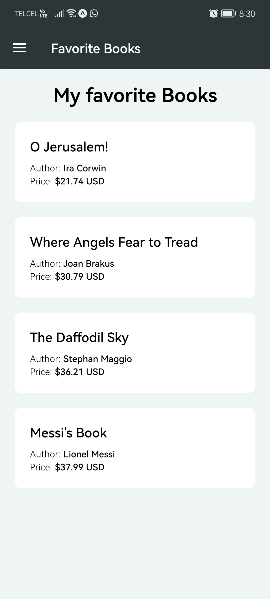
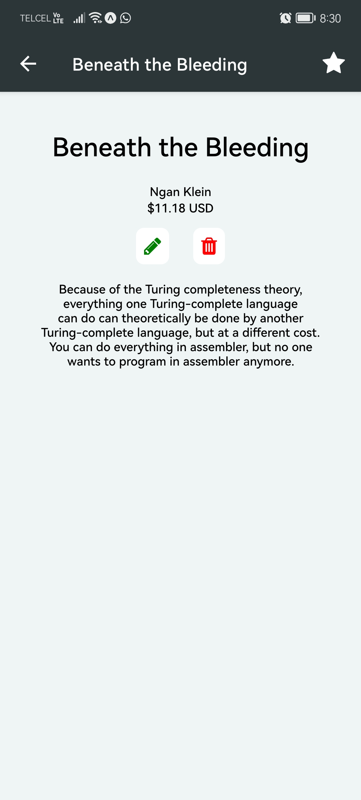

# The Bookstore.

The Bookstore is a mobile application where users can create, update, delete and see all the books stored in the database.
This mobile is been comunication with the Bookstore Rails API created in the Microsoft Azure services.
For more infomration, you can checkt the Rails API repo where you will find all the information related to the Bookstore Project.

## Preview.

In the image below you can see a short demonstration of the Bookstore App

## Images.

Theser were the screens created in order to build this app.

  
  
  

  
  
  

## Softwares.

These are the softwares and versions needed to the Bookstore Project.

- Front-end: React Native.
- Back-end: Ruby on Rails 7.
- TailwindCSS.

Here in this link, you will find the Api Rails repository: https://github.com/Jorge-Ortiz-Mata/app-04-bookstore-rails-api
## Author.

- Jorge Ortiz.
- Software engineer.
- ortiz.mata.jorge@gmail.com
